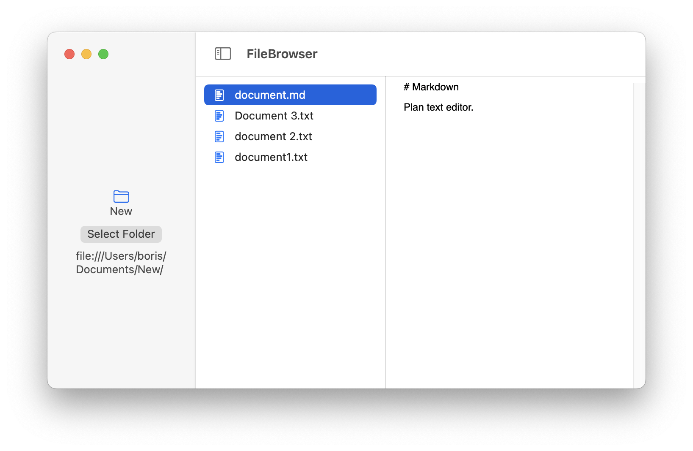

# FileBrowser

<strong>Plain Text Editor With Document Browser.</strong>

This is a sample project I decided to publish together with [the blog post][1] with everything 
I learned so far about working with the file system on macOS. There are not many modern working `AppKit` code examples out there. 
It's fun to develop for the Mac, and I hope this helps someone, it always great to 
see more native applications out there.

## Features

- 100% `SwiftUI`
- Monitors file changes with [`DispatchSource`][2] 
- Basic text editing
- Working example of how to use `NSDocument`
- Pick a root folder and get permanent read/write access without violating Sandobx
- No need for full disk access or permission dialogues 
- Conflicts resolution
- Potentially compatible with `UIKit`

Visit my [website](https://www.cocoa.productions), subscribe to my [micro blog.](https://micro.cocoaswitch.com)

[1]: https://micro.cocoaswitch.com/2023/04/06/working-with-file.html
[2]: https://developer.apple.com/documentation/dispatch/dispatchsource
